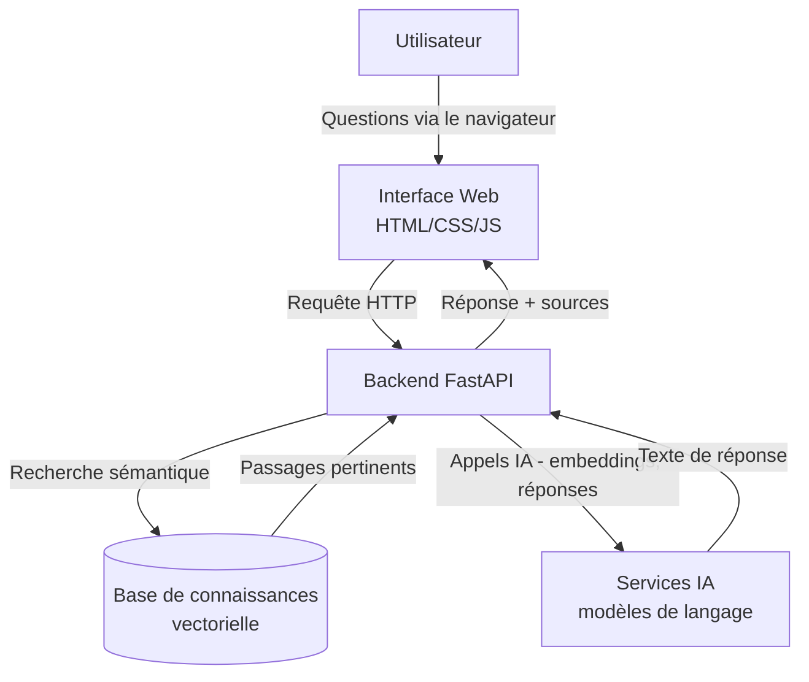
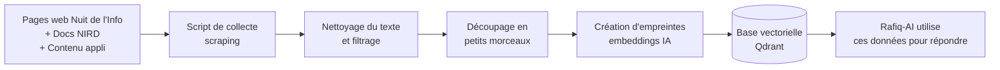
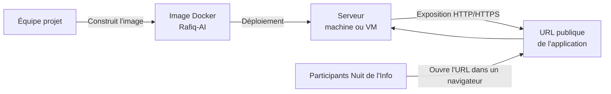

# Architecture Rafiq-AI

## 1. Architecture Globale de l'Application

```mermaid
graph TD
    U[Utilisateur] -->|Questions via le navigateur| F[Interface Web<br/>HTML/CSS/JS]

    F -->|Requête HTTP| B[Backend FastAPI]

    B -->|Recherche sémantique| Q[(Base de connaissances<br/>vectorielle)]
    B -->|Appels IA - embeddings, réponses| M[Services IA<br/>modèles de langage]

    Q -->|Passages pertinents| B
    M -->|Texte de réponse| B
    B -->|Réponse + sources| F
```

## 2. Pipeline de Traitement des Données

```mermaid
graph LR
    A[Pages web Nuit de l'Info<br/>+ Docs NIRD<br/>+ Contenu appli] 
        --> B[Script de collecte<br/>scraping]

    B --> C[Nettoyage du texte<br/>et filtrage]
    C --> D[Découpage en<br/>petits morceaux]

    D --> E[Création d'empreintes<br/>embeddings IA]
    E --> F[(Base vectorielle<br/>Qdrant)]

    F --> G[Rafiq-AI utilise<br/>ces données pour répondre]
```

## 3. Déploiement et Accès

```mermaid
graph LR
    Dev[Équipe projet] -->|Construit l'image| Img[Image Docker<br/>Rafiq-AI]

    Img -->|Déploiement| S[Serveur<br/>machine ou VM]
    S -->|Exposition HTTP/HTTPS| Web[URL publique<br/>de l'application]

    User[Participants Nuit de l'Info] -->|Ouvre l'URL dans un navigateur| Web
    Web --> S
```
